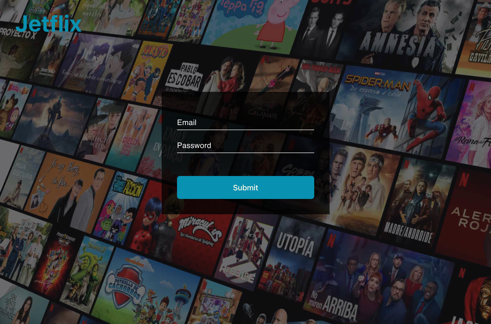
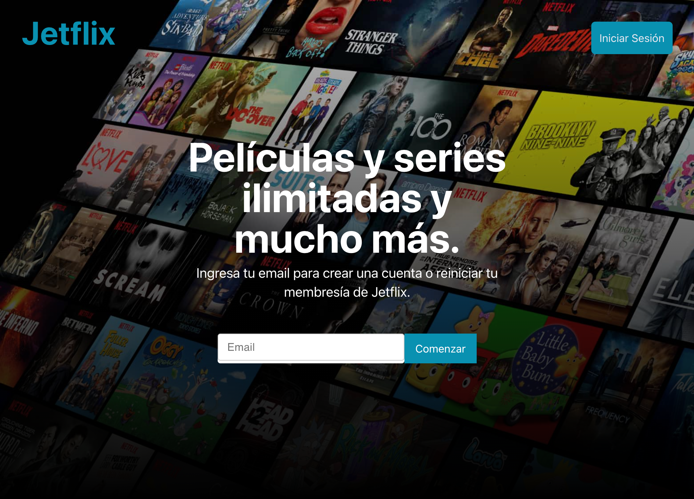
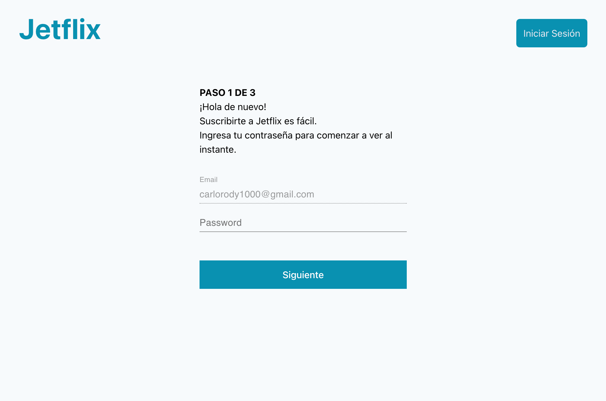
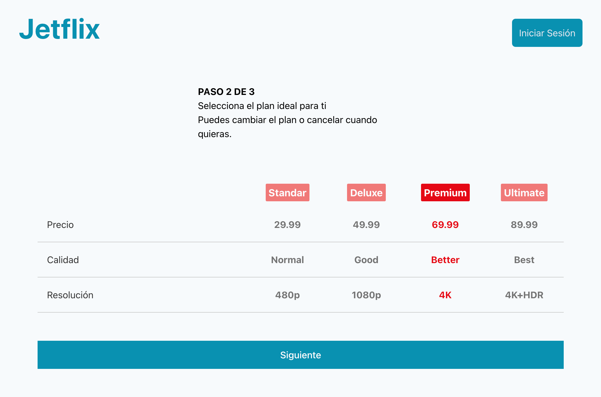
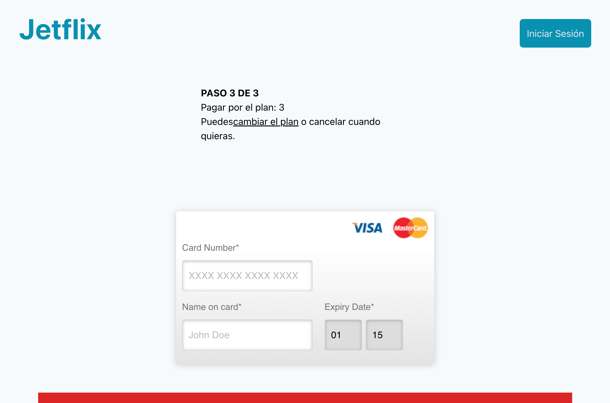

# Jetflix with Create React App

This project is a similar example of netflix

## Steps

In this project, you can run:
#
Clone the project:
>```git clone https://github.com/rodycastillo/jetflix```
#
Install the packages:
>```npm install```
#
 Create new file (base directory) called .env and then add ↓↓↓:
>```BASE_URL=http://localhost:8080```
#
Finally:
>```npm start```
#
Login



#
Home unLogged 


#
Register Step 1


#
Register Step 2


#
Register Step 3
